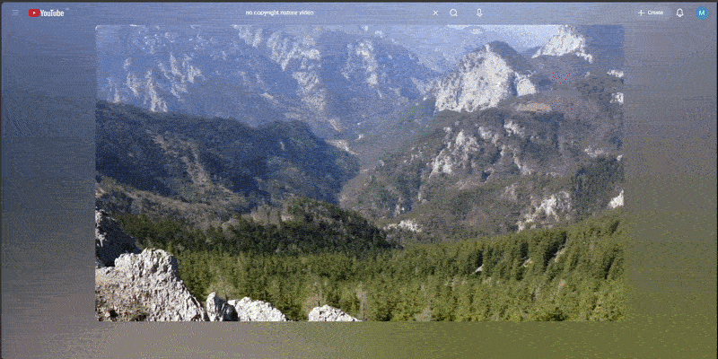

# Ambient Mode Layout

Transform the way you watch YouTube on desktop.

**Ambient Mode Layout** is a companion Chrome extension designed to work
alongside an ambient-light extension such as **Ambient light for
YouTube™**. The ambient-light extension creates the cinematic glow
around the video, while Ambient Mode Layout reorganizes the YouTube
watch page so the video, comments, and recommendations can be viewed
together in a more immersive layout.

The result is a YouTube experience that feels less like a conventional
webpage and more like a dedicated video-viewing workspace.

------------------------------------------------------------------------

## What does Ambient Mode Layout do?

A normal YouTube watch page separates the main video, comments, and
recommendations into a vertically scrolling layout.

Ambient Mode Layout changes that experience by reorganizing the desktop
watch page into a side-by-side layout:

``` text
┌─────────────────────────────────────────────────────────────────┐
│                         YouTube Header                          │
├───────────────────────────────────────┬─────────────────────────┤
│                                       │                         │
│              VIDEO                    │     RECOMMENDATIONS     │
│                                       │                         │
│                                       │                         │
├───────────────────────────────────────┤                         │
│                                       │                         │
│              COMMENTS                 │                         │
│                                       │                         │
└───────────────────────────────────────┴─────────────────────────┘
```

Instead of repeatedly scrolling between the video, comments, and
recommended videos, the important parts of the watch page remain visible
together.


------------------------------------------------------------------------

# Recommended Setup

Ambient Mode Layout is designed to complement an ambient-light
extension.

For the intended experience, install the extensions in this order:

### Step 1 --- Install an ambient-light extension

Install an extension such as:

**Ambient light for YouTube™**

This type of extension creates the ambient/cinematic light effect around
the YouTube video.

For example, the video can produce a soft glow around the player based
on the video's visual content.

### Step 2 --- Install Ambient Mode Layout

Install **Ambient Mode Layout** from the Chrome Web Store.

This extension does something different:

-   reorganizes the YouTube watch page
-   places recommendations alongside the video
-   places comments in a more convenient viewing area
-   provides configurable layout controls
-   creates a more focused desktop viewing workspace

### Step 3 --- Open a YouTube video

Open any normal YouTube watch page.

The two extensions work at different layers:

``` text
YouTube
   │
   ├── Ambient-light extension
   │      └── Creates the cinematic light / glow around the video
   │
   └── Ambient Mode Layout
          └── Reorganizes the YouTube watch-page layout
```

Together, they provide a more cinematic and organized viewing
experience.

------------------------------------------------------------------------

# The Experience

## Before

The standard YouTube desktop experience generally requires you to move
vertically between:

-   Video
-   Video information
-   Comments
-   Recommended videos

This can make it harder to keep the video and surrounding content
visible at the same time.

## After

Ambient Mode Layout reorganizes the watch page so that the major viewing
areas can coexist:

**Video + Comments + Recommendations**

This means you can:

-   watch the video
-   follow the comments
-   browse recommendations
-   switch between related content

without constantly moving back and forth through the page.

------------------------------------------------------------------------

# Key Features

## Side-by-side watch layout

The extension reorganizes the YouTube watch page into a desktop-oriented
layout where the video and surrounding content can be viewed together.

## Comments alongside the viewing experience

Comments are positioned as part of the viewing workspace instead of
requiring continuous scrolling below the video.

## Recommendations remain accessible

Related/recommended videos stay available alongside the main viewing
area, making it easier to discover what to watch next.

## Configurable layout

The extension provides controls for adjusting the viewing layout.

Current preferences include:

-   **Enable / disable layout**
-   **Comments width**
-   **Recommendations width**
-   **Sticky recommendations**

These preferences are saved so your chosen layout can persist between
sessions.

## Cinematic companion experience

When used with an ambient-light extension, the page layout and visual
atmosphere complement each other:

``` text
Ambient Light
      +
Ambient Mode Layout
      ↓
More immersive YouTube desktop experience
```

The ambient-light extension controls the visual glow around the video.

Ambient Mode Layout controls the structure of the YouTube watch page.

------------------------------------------------------------------------

# Why use both extensions?

The two extensions solve different problems.

  -----------------------------------------------------------------------
  Extension                           Main purpose
  ----------------------------------- -----------------------------------
  Ambient-light extension             Creates ambient/cinematic lighting
                                      around the video

  Ambient Mode Layout                 Reorganizes the YouTube watch-page
                                      layout
  -----------------------------------------------------------------------

Neither extension needs to replace the other's purpose.

The idea is simple:

> **One changes the atmosphere. The other changes the layout.**

------------------------------------------------------------------------

# Extension Controls

Open the **Ambient Mode Layout** extension popup while viewing YouTube.

You can configure:

### Layout

Enable or disable the layout transformation.

### Comments width

Control how much horizontal space is allocated to comments.

### Recommendations width

Control the width of the recommendations/related-content area.

### Sticky recommendations

Keep recommendations positioned within the viewing workspace while
navigating the page.

Your selected settings are saved using Chrome's extension storage.

------------------------------------------------------------------------

# Best Experience

For the best desktop viewing experience:

1.  Install an ambient-light extension.
2.  Install Ambient Mode Layout.
3.  Open YouTube on desktop.
4.  Open a normal YouTube watch page.
5.  Configure the layout from the Ambient Mode Layout popup.
6.  Adjust comments and recommendation widths to your preference.
7.  Enable sticky recommendations if you prefer persistent access to
    related videos.
8.  Enjoy YouTube with both the ambient visual effect and the
    reorganized watch layout.

------------------------------------------------------------------------

# Supported Experience

Ambient Mode Layout is primarily designed for:

-   Desktop YouTube
-   Standard YouTube watch pages
-   Chromium-based browsers that support Chrome extensions

The extension is specifically designed around the desktop YouTube
watch-page structure.

YouTube frequently changes its frontend implementation, so future
YouTube UI changes may require updates to the extension.

------------------------------------------------------------------------

# Privacy

Ambient Mode Layout is designed to process the YouTube page locally in
the browser.

The extension stores only its layout preferences, including:

-   `enabled`
-   `commentsWidth`
-   `relatedWidth`
-   `stickyRelated`

It does not operate a developer backend for collecting YouTube content.

The extension does not intentionally transmit YouTube comments, video
information, account information, credentials, or other personal
information to a developer-operated server.

For complete details, see the project's Privacy Policy.

**Privacy Policy:**\
`YOUR_PRIVACY_POLICY_URL`

> Replace `YOUR_PRIVACY_POLICY_URL` with the deployed GitHub Pages
> privacy-policy URL before publishing this README.

------------------------------------------------------------------------

# Important: Third-Party Ambient-Light Extension

Ambient Mode Layout is designed to work well alongside ambient-light
extensions, but it is **not affiliated with, endorsed by, or maintained
by the developers of those extensions**.

The ambient-light effect is provided by the separate extension you
install.

Ambient Mode Layout is responsible only for the YouTube page layout and
related configuration described in this README.

------------------------------------------------------------------------

# Troubleshooting

## The layout does not appear

Make sure you are on a standard YouTube watch page.

Try:

1.  Refreshing the YouTube page.
2.  Checking that Ambient Mode Layout is enabled.
3.  Opening the extension popup and verifying the settings.
4.  Checking that the extension is enabled in Chrome.
5.  Opening another normal YouTube video.

## The ambient glow is not visible

Ambient Mode Layout does not generate the ambient-light effect itself.

Check that your separate ambient-light extension is installed and
enabled.

## The layout looks incorrect

YouTube's interface changes frequently.

Try refreshing the page first.

If the problem continues, report the issue with:

-   Browser name and version
-   YouTube page URL or video type
-   Screenshot
-   Ambient Mode Layout version
-   Other YouTube layout extensions installed

------------------------------------------------------------------------

# Development

This project is a browser extension built to modify the YouTube desktop
watch-page layout.

The extension uses:

-   Chrome Extension Manifest V3
-   JavaScript
-   Chrome Storage API
-   YouTube DOM manipulation
-   CSS-based layout controls

The extension's content scripts operate on YouTube pages matching:

``` text
https://www.youtube.com/*
```

------------------------------------------------------------------------

# Project Goal

The goal of Ambient Mode Layout is not to replace YouTube.

It is to improve the desktop viewing experience by making better use of
the available screen space.

The core idea is:

> **Keep the video, conversation, and discovery experience visible
> together.**

Combined with an ambient-light extension, the result is intended to make
YouTube feel more like an immersive desktop media player rather than a
page that requires constant scrolling.

------------------------------------------------------------------------

# Disclaimer

YouTube is a trademark of Google LLC.

Ambient Mode Layout is an independent browser extension and is not
affiliated with or endorsed by YouTube or Google.

Any third-party extensions mentioned in this README are independent
products. Their names and trademarks belong to their respective owners.

------------------------------------------------------------------------

# License

Add your project's license information here if applicable.
